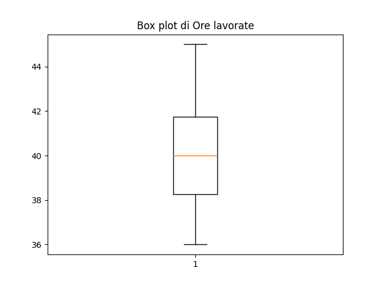

# Dashboard Interattiva di Analisi Dati.

# dashboard-analisi-dati

Questa è una dashboard interattiva per l'analisi esplorativa dei dati sviluppata in **Python** utilizzando la libreria **Streamlit**. Permette di caricare file CSV, generare grafici (istogrammi, pie chart, boxplot) e ottenere statistiche di base, con la possibilità di esportare i risultati in PDF e CSV.

---

## 🚀 Tecnologie utilizzate
- Python 3.12
- Streamlit
- Pandas
- Matplotlib
- Plotly
- fpdf

---

## ✨ Funzionalità principali
✅ Caricamento di file CSV  
✅ Visualizzazione dell'anteprima dei dati  
✅ Selezione delle colonne numeriche da analizzare  
✅ Generazione automatica di grafici (istogramma, grafico a torta, boxplot)  
✅ Statistiche di base (media, deviazione standard, ecc.)  
✅ Esportazione dei grafici e delle statistiche in PDF e CSV  

---

## 📸 Screenshot

Ecco un'anteprima della dashboard in funzione:  



---

## 📦 Come usare il progetto

### 1️⃣ Clona il repository
```bash
git clone https://github.com/steveproject73/dashboard-analisi-dati.git
cd dashboard-analisi-dati
